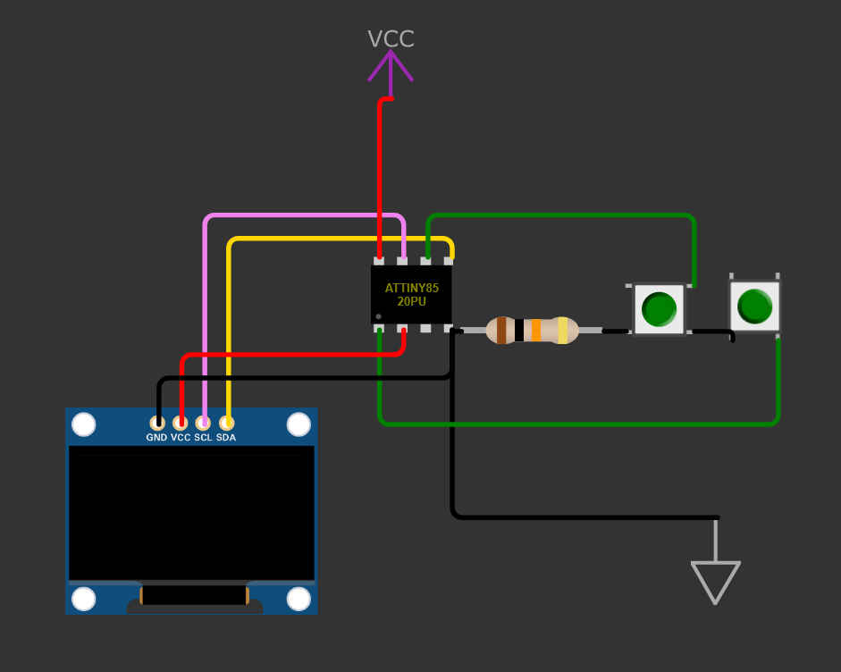

# About
  This is a small (~3KB after compilation) Tamagotchi-like device I made. It has very little function but looks cute!
  It uses an ATTiny85 Chip as its processor, a 128x64 SSD1306 OLED and a small LiPo battery. In low power mode it draws 0.1μA, and in use it draws 4.75mA, both at 5V [Be aware, power consumption appears to be highly variable from chip to chip].
  The Hatsune Miku image was copied off of the official Hatsune Mike Tamagotchis. 
### Wiring diagram

